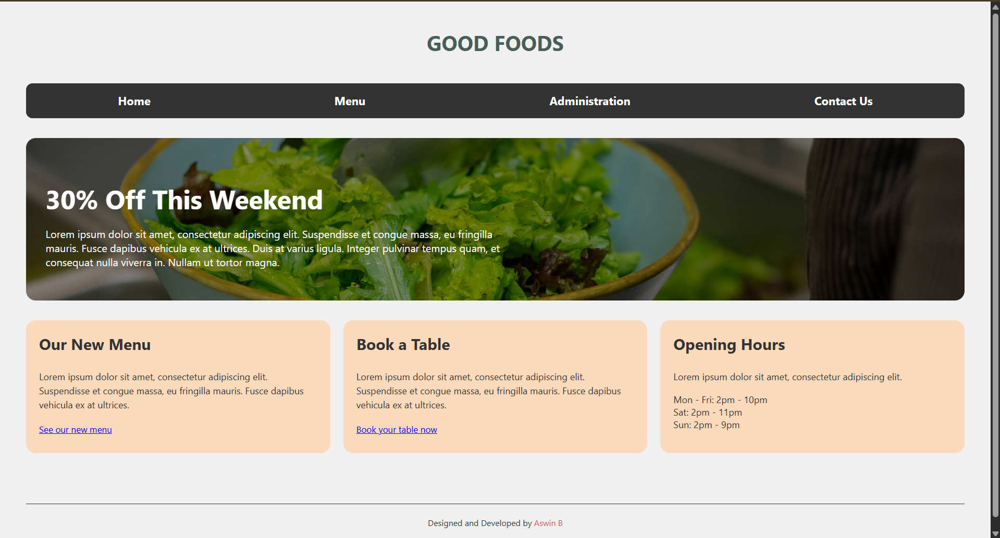
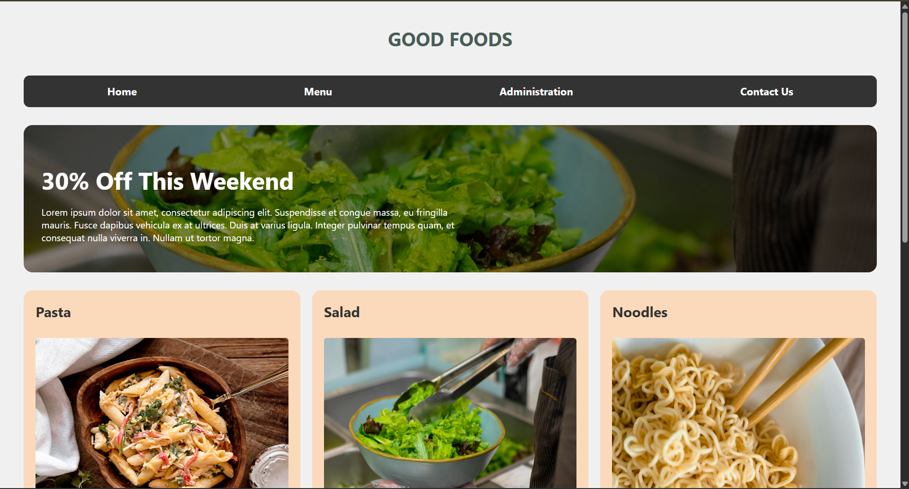
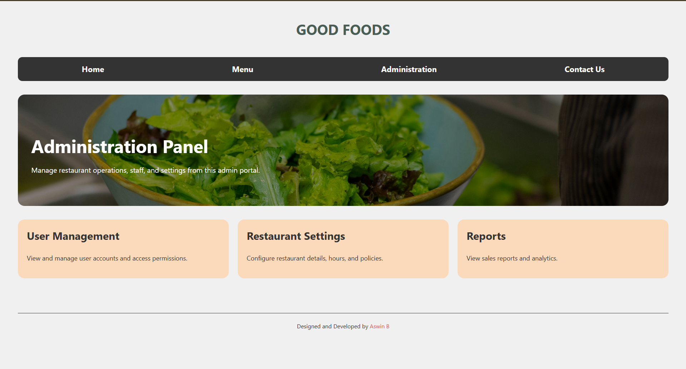
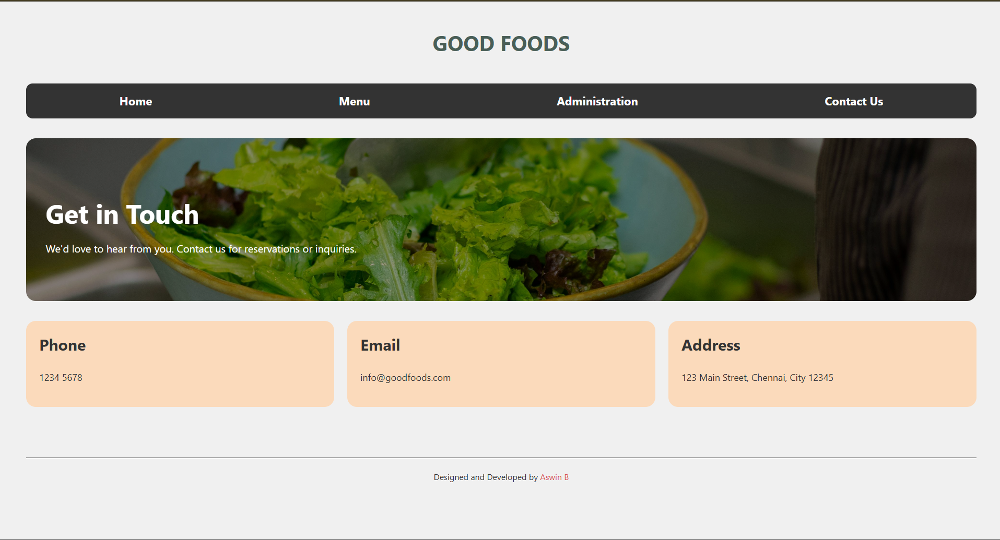

# Ex.06 Restuarant Website
## Date: 16-02-2025

## AIM:
To develop a static Resturant website to display the menu and services provided by the resturant.

## DESIGN STEPS:

### Step 1:
Requirement collection.

### Step 2:
Creating the layout using HTML and CSS.

### Step 3:
Updating the sample content.

### Step 4:
Choose the appropriate style and color scheme.

### Step 5:
Validate the layout in various browsers.

### Step 6:
Validate the HTML code.

### Step 7:
Publish the website in the given URL.

## PROGRAM:
### index.html
```html
<!doctype html>
<html lang="en">
  <head>
    <meta charset="UTF-8" />
    <meta name="viewport" content="width=device-width, initial-scale=1.0" />
    <title>Good Foods</title>
    <link rel="stylesheet" href="style.css" />
  </head>
  <body>
    <header>
      <h1>Good Foods</h1>
    </header>

    <nav>
      <ul>
        <li><a href="#">Home</a></li>
        <li><a href="./menu.html">Menu</a></li>
        <li><a href="./admin.html">Administration</a></li>
        <li><a href="./contact.html">Contact Us</a></li>
      </ul>
    </nav>

    <section class="hero">
      <div class="hero-content">
        <h2>30% Off This Weekend</h2>
        <p>
          Lorem ipsum dolor sit amet, consectetur adipiscing elit. Suspendisse
          et congue massa, eu fringilla mauris. Fusce dapibus vehicula ex at
          ultrices. Duis at varius ligula. Integer pulvinar tempus quam, et
          consequat nulla viverra in. Nullam ut tortor magna.
        </p>
      </div>
    </section>

    <main class="container">
      <div class="card">
        <h3>Our New Menu</h3>
        <p>
          Lorem ipsum dolor sit amet, consectetur adipiscing elit. Suspendisse
          et congue massa, eu fringilla mauris. Fusce dapibus vehicula ex at
          ultrices.
        </p>
        <a href="./menu.html" class="link">See our new menu</a>
      </div>

      <div class="card">
        <h3>Book a Table</h3>
        <p>
          Lorem ipsum dolor sit amet, consectetur adipiscing elit. Suspendisse
          et congue massa, eu fringilla mauris. Fusce dapibus vehicula ex at
          ultrices.
        </p>
        <a href="#" class="link">Book your table now</a>
      </div>

      <div class="card">
        <h3>Opening Hours</h3>
        <p>Lorem ipsum dolor sit amet, consectetur adipiscing elit.</p>
        <ul class="hours">
          <li>Mon - Fri: 2pm - 10pm</li>
          <li>Sat: 2pm - 11pm</li>
          <li>Sun: 2pm - 9pm</li>
        </ul>
      </div>
    </main>

    <footer>
      <hr class="footer-line" />
      <p class="credits">
        Designed and Developed by <span class="author">Aswin B</span>
      </p>
    </footer>
  </body>
</html>
```

### menu.html
```html
<!doctype html>
<html lang="en">
  <head>
    <meta charset="UTF-8" />
    <meta name="viewport" content="width=device-width, initial-scale=1.0" />
    <title>Menu | Good Foods</title>
    <link rel="stylesheet" href="style.css" />
  </head>
  <body>
    <header>
      <h1>Good Foods</h1>
    </header>

    <nav>
      <ul>
        <li><a href="./index.html">Home</a></li>
        <li><a href="./menu.html">Menu</a></li>
        <li><a href="./admin.html">Administration</a></li>
        <li><a href="./contact.html">Contact Us</a></li>
      </ul>
    </nav>

    <section class="hero">
      <div class="hero-content">
        <h2>30% Off This Weekend</h2>
        <p>
          Lorem ipsum dolor sit amet, consectetur adipiscing elit. Suspendisse
          et congue massa, eu fringilla mauris. Fusce dapibus vehicula ex at
          ultrices. Duis at varius ligula. Integer pulvinar tempus quam, et
          consequat nulla viverra in. Nullam ut tortor magna.
        </p>
      </div>
    </section>

    <main class="menu-container">
      <div class="menu-card">
        <h3>Pasta</h3>
        
        <p>
          Lorem ipsum dolor, sit amet consectetur adipisicing elit. Assumenda,
          animi.
        </p>
      </div>

      <div class="menu-card">
        <h3>Salad</h3>
        
        <p>
          Lorem ipsum dolor, sit amet consectetur adipisicing elit. Assumenda,
          animi.
        </p>
      </div>

      <div class="menu-card">
        <h3>Noodles</h3>
        
        <p>
          Lorem ipsum dolor, sit amet consectetur adipisicing elit. Assumenda,
          animi.
        </p>
      </div>

      <div class="menu-card">
        <h3>Smoothie</h3>
        
        <p>
          Lorem ipsum dolor, sit amet consectetur adipisicing elit. Assumenda,
          animi.
        </p>
      </div>

      <div class="menu-card">
        <h3>Cake</h3>
        
        <p>
          Lorem ipsum dolor, sit amet consectetur adipisicing elit. Assumenda,
          animi.
        </p>
      </div>

      <div class="menu-card">
        <h3>Pasta</h3>
        
        <p>
          Lorem ipsum dolor, sit amet consectetur adipisicing elit. Assumenda,
          animi.
        </p>
      </div>
    </main>

    <footer>
      <hr class="footer-line" />
      <p class="credits">
        Designed and Developed by <span class="author">Aswin B</span>
      </p>
    </footer>
  </body>
</html>
```

### admin.html
```html
<!doctype html>
<html lang="en">
  <head>
    <meta charset="UTF-8" />
    <meta name="viewport" content="width=device-width, initial-scale=1.0" />
    <title>Administration | Good Foods</title>
    <link rel="stylesheet" href="style.css" />
  </head>
  <body>
    <header>
      <h1>Good Foods</h1>
    </header>

    <nav>
      <ul>
        <li><a href="./index.html">Home</a></li>
        <li><a href="./menu.html">Menu</a></li>
        <li><a href="./admin.html">Administration</a></li>
        <li><a href="./contact.html">Contact Us</a></li>
      </ul>
    </nav>

    <section class="hero">
      <div class="hero-content">
        <h2>Administration Panel</h2>
        <p>
          Manage restaurant operations, staff, and settings from this admin
          portal.
        </p>
      </div>
    </section>

    <main class="container">
      <div class="card">
        <h3>User Management</h3>
        <p>View and manage user accounts and access permissions.</p>
      </div>

      <div class="card">
        <h3>Restaurant Settings</h3>
        <p>Configure restaurant details, hours, and policies.</p>
      </div>

      <div class="card">
        <h3>Reports</h3>
        <p>View sales reports and analytics.</p>
      </div>
    </main>
    <footer>
      <hr class="footer-line" />
      <p class="credits">
        Designed and Developed by <span class="author">Aswin B</span>
      </p>
    </footer>
  </body>
</html>
```

### contact.html
```html
<!doctype html>
<html lang="en">
  <head>
    <meta charset="UTF-8" />
    <meta name="viewport" content="width=device-width, initial-scale=1.0" />
    <title>Contact Us | Good Foods</title>
    <link rel="stylesheet" href="style.css" />
  </head>
  <body>
    <header>
      <h1>Good Foods</h1>
    </header>

    <nav>
      <ul>
        <li><a href="./index.html">Home</a></li>
        <li><a href="./menu.html">Menu</a></li>
        <li><a href="./admin.html">Administration</a></li>
        <li><a href="./contact.html">Contact Us</a></li>
      </ul>
    </nav>

    <section class="hero">
      <div class="hero-content">
        <h2>Get in Touch</h2>
        <p>
          We'd love to hear from you. Contact us for reservations or inquiries.
        </p>
      </div>
    </section>

    <main class="container">
      <div class="card">
        <h3>Phone</h3>
        <p>1234 5678</p>
      </div>

      <div class="card">
        <h3>Email</h3>
        <p>info@goodfoods.com</p>
      </div>

      <div class="card">
        <h3>Address</h3>
        <p>123 Main Street, Chennai, City 12345</p>
      </div>
    </main>
    <footer>
      <hr class="footer-line" />
      <p class="credits">
        Designed and Developed by <span class="author">Aswin B</span>
      </p>
    </footer>
  </body>
</html>
```

### style.css
```css
body {
  font-family: "Segoe UI", Tahoma, Geneva, Verdana, sans-serif;
  margin: 0;
  padding: 0;
  background-color: #f0f0f0;
  color: #333;
}

header {
  text-align: center;
  padding: 20px 0;
}

h1 {
  color: #495e57;
  text-transform: uppercase;
  font-weight: bold;
}

nav {
  background-color: #333;
  margin: 0 40px;
  border-radius: 10px;
}

nav ul {
  list-style: none;
  display: flex;
  justify-content: space-around;
  padding: 15px 0;
  margin: 0;
}

nav a {
  text-decoration: none;
  color: white;
  font-weight: bold;
  font-size: 1.1rem;
}

.hero {
  margin: 30px 40px;
  height: 250px;
  background:
    linear-gradient(rgba(0, 0, 0, 0.4), rgba(0, 0, 0, 0.4)), url("./salad.jpg");
  background-size: cover;
  background-position: center;
  border-radius: 15px;
  display: flex;
  align-items: center;
  padding: 0 30px;
}

.hero-content {
  color: white;
  max-width: 700px;
}

.hero-content h2 {
  font-size: 2.5rem;
  margin-bottom: 10px;
}

.container {
  display: flex;
  justify-content: space-between;
  padding: 0 40px;
  gap: 20px;
}

.card {
  background-color: #fbdabb;
  padding: 20px;
  border-radius: 15px;
  flex: 1;
}

.card h3 {
  margin-top: 0;
  font-size: 1.5rem;
}

.card img {
  width: 100%;
  border-radius: 5px;
  margin: 15px 0;
}

.card p {
  font-size: 0.9rem;
  line-height: 1.5;
}

.link {
  color: blue;
  text-decoration: underline;
  font-size: 0.85rem;
}

.hours {
  list-style: none;
  padding: 0;
  font-size: 0.9rem;
}

footer {
  margin-top: 50px;
  padding: 20px 40px;
}

.footer-line {
  flex-grow: 1;
  border: 0;
  border-top: 1px solid #333;
}

.credits {
  text-align: center;
  font-size: 0.8rem;
  margin-top: 20px;
}

.author {
  color: #d9534f;
}

.menu-container {
  display: grid;
  grid-template-columns: repeat(3, 1fr);
  justify-content: space-between;
  padding: 0 40px;
  gap: 20px;
}

.menu-card {
  background-color: #fbdabb;
  padding: 20px;
  border-radius: 15px;
  flex: 1;
}

.menu-card h3 {
  margin-top: 0;
  font-size: 1.5rem;
}

.menu-card img {
  width: 100%;
  border-radius: 5px;
  margin: 5px 0;
  aspect-ratio: 4/3;
}

.card p {
  font-size: 0.9rem;
  line-height: 1.5;
}

```


## OUTPUT:






## RESULT:
The program for designing software company website using HTML and CSS is completed successfully.


Name: ASWIN B \
Register Number : 212224110007
